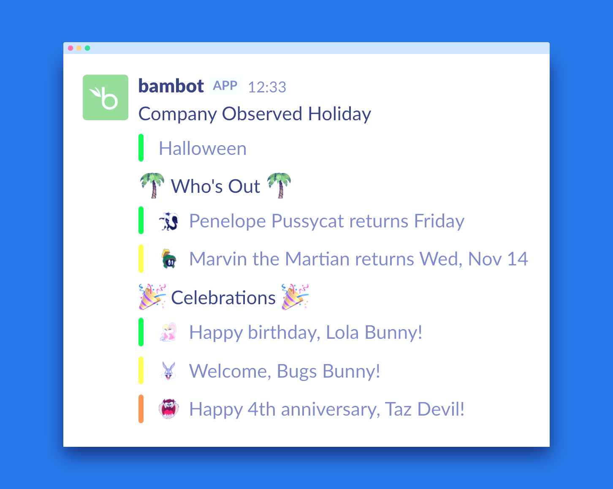

# bambot

BambooHR Slack bot that, each weekday, publishes

- Who is out
- Birthdays
- Work anniversaries, including a welcome message on the first day
- Company-observed holidays

## Setup

- Clone the repository and run `npm install`
- If you have access, generate a [BambooHR API key](https://www.bamboohr.com/api/documentation/) within your account. Otherwise, have a BambooHR admin at your company generate one for you.
- Determine the BambooHR subdomain associated with your company
- Configure a Slack [Incoming Webhook](https://slack.com/apps/manage/custom-integrations)

## Developing

- Run tests, `npm test`
- Invoke locally, `npm run invoke`

## Deploying

- Deploy to AWS, `BAMBOOHR_KEY=YOUR_KEY BAMBOOHR_SUBDOMAIN=YOUR_SUBDOMAIN SLACK_WEBHOOK_URL=YOUR_URL npm run deploy`. It will run Mon-Fri at 6 a.m. UTC, you can adjust this schedule in `serverless.yml`.
